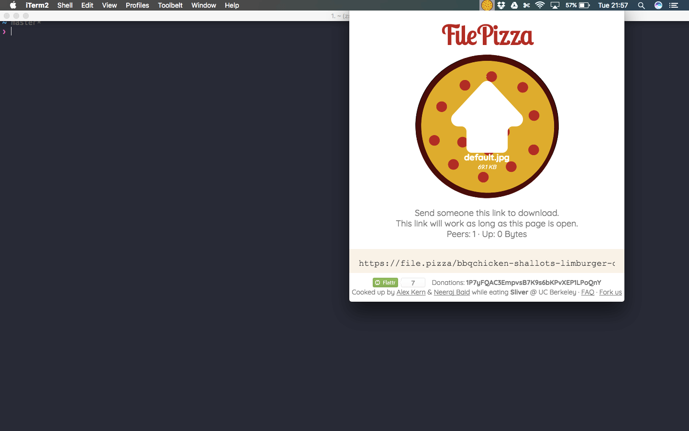

# pizza-menubar

> File.pizza in your menubar (p2p file transfer)



## Usage
Download the app [here](./pizza-menubar-darwin-x64.zip).
Currently Supports mac only.
## Dev
Built With Electron
```
$ npm install

# then use electron or electron-packager to build/run the app:
$ npm install electron-prebuilt -g
$ electron index.js
```

## License

MIT © [Nikhil Srivastava](http://niksrc.github.io)
